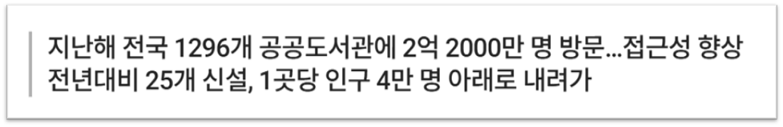
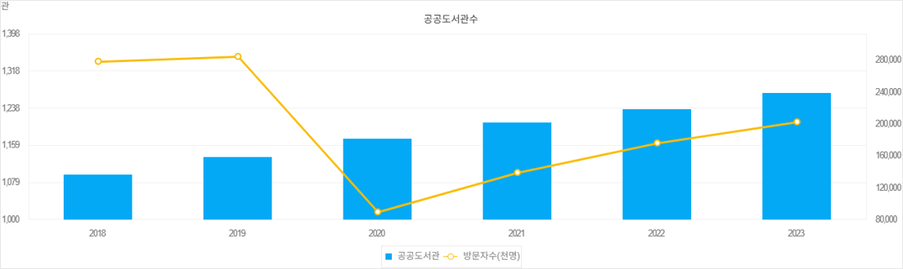
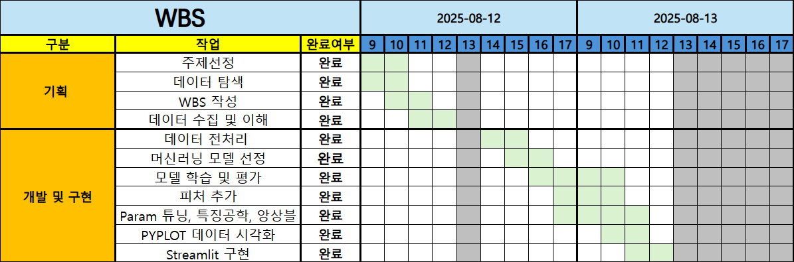
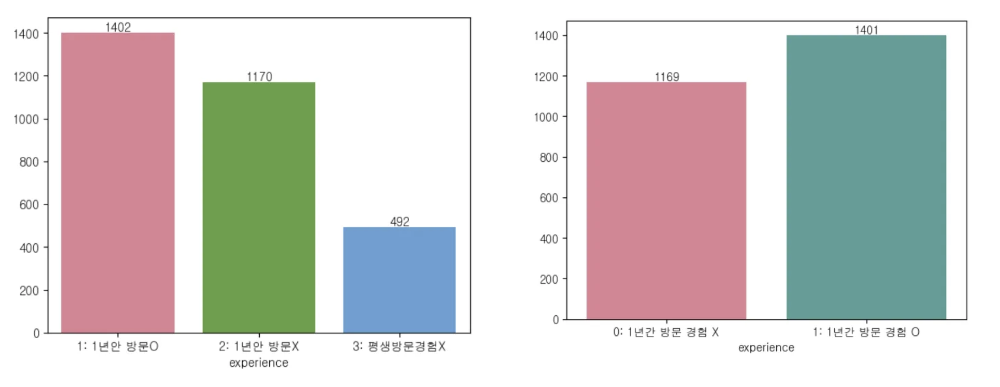
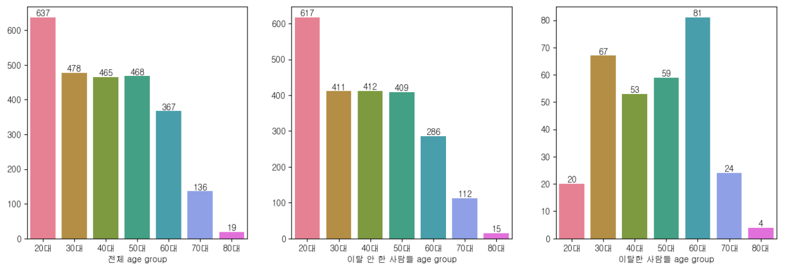
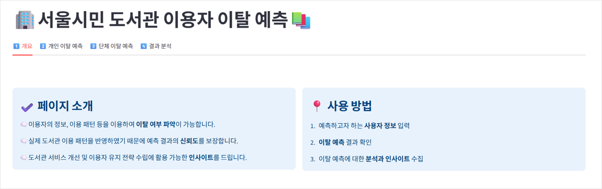
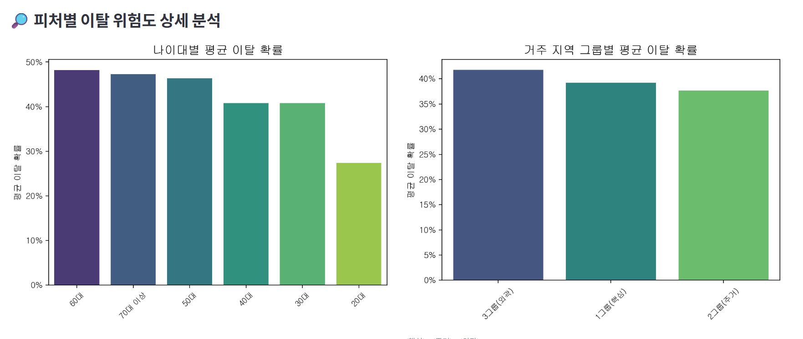
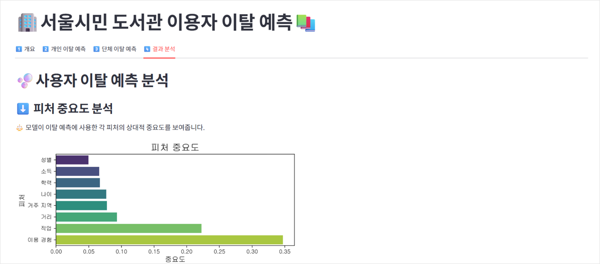

# 🔖2nd_PROJECT_2TEAM

 

# **프로젝트 명 : 도서관 이용자 이탈률 예측** 📚

 

## 💡**팀명 : Libraritics**

 

✔️ Library + Analytics의 합성어로, **도서관**과 **이탈률 분석**이라는 프로젝트의 핵심 주제를 직관적으로 표현하였습니다.

✔️ 데이터 분석을 통해 도서관 이용자 이탈 현상을 이해하고, 이를 기반으로 효과적인 운영 전략을 제시하겠다는 **프로젝트의 목표**를 담고 있습니다.

 

---

## 🌟 **팀원 소개**  

 

✔️ 인상 깊게 읽은 책 또는 나를 표현할 수 있는 책을 담았습니다.

 

| 💻👩 양송이 | 💻👩 박지수 | 💻🧑 조세희| 💻🧑 김세한 | 💻🧑 양정민 |
|---|---|---|---|---|
|  |  |  |  |  | 
|[@songeeeey](https://github.com/songeeeey)| [@0lipa](https://github.com/0lipa) | [@SEHEE-8546](https://github.com/SEHEE-8546) | [@kimsehan11](https://github.com/kimsehan11) | [Yangmin3](https://github.com/Yangmin3)|

 

---

## 1. 프로젝트 개요 🔍

### 1.1 프로젝트 주제 선정 배경

 

 

>_디스커버리 뉴스: [문체부, '2025년 전국 공공도서관 통계조사' 결과 발표](https://www.discoverynews.kr/news/articleView.html?idxno=1064416&utm_source=chatgpt.com)_

>_농민 뉴스: [북캉스’ 최적지 공공도서관 …지난해 이용자 2억명 ‘훌쩍’](https://www.nongmin.com/article/20240806500181?utm_source=chatgpt.com)_

 

### 그러나,

 

>_출처: [통계청 지표누리](https://www.index.go.kr/unity/potal/main/EachDtlPageDetail.do?idx_cd=1639)_

 

 

최근 도서관 이용자 수 통계에 따르면, **코로나19 팬데믹 시기**(2019→2020)에 25만 명 이상이던 **이용자 수가 급격히 감소**했습니다. 이후 점진적으로 회복되고 있으나, 여전히 코로나 이전 수준에는 미치지 못하고 있습니다.

그 뿐만 아니라 다양한 온라인 콘텐츠의 확산과 전자책의 보급 그리고 코로나19 등과 같이 사회적 변화들이 도서관 이용자 수에 영향을 미치고 있습니다.

 

---

### 1.2 프로젝트 주제 필요성

 

이러한 상황에서 도서관 운영진들은 크게 **두 가지 과제**에 직면해 있습니다.

① 새로운 이용자를 **유입**하는 것

② 기존 이용자의 **이탈을 방지**하는 것

저희는 특히 **두 번째 과제**, **이탈 방지**에 주목했습니다. 신규 이용자 유입보다 기존 이용자를 유지하는 것이 장기적으로 더 안정적이고 비용 면에서도 더 효율적이기 때문입니다.

> 조사결과, 도서관 밖 유동인구 수는 증가하고 있지만, 도서관으로 유입되는 방문자 수는 감소하는 것으로 나타났다.
> 
> 
> *(출처: 박성재, 2023.01.09,공공도서관 이용자는 도서관을 어떻게 이용하는가?, 한국문헌정보학회지)*

 

단순한 이용 통계만으로는 이탈 원인을 파악하기 어려우므로, **인구통계학적 특성**(성별, 연령, 거주지, 소득, 학력, 거리)과 **이용 경험 데이터**를 결합해 분석하는 예측 모델이 필요합니다.

 

---

### 1.3 프로젝트 목적

 

- **주요 영향 요인 분석**: 이탈에 영향을 미치는 핵심 변수들을 식별하고 그 중요도를 정량화
- **이탈 예측 모델 개발**: 다양한 머신러닝 분류 모델을 활용하여 도서관 이용자의 이탈 가능성을 예측하는 최적 모델 도출
- **도서관 운영 개선**: 예측 결과를 바탕으로 도서관 서비스 개선 및 이용자 유지 전략 수립에 활용할 수 있는 인사이트 제공

 

<mark>**"도서관 이용자의 이탈은 인구통계학적 특성(성별, 나이, 거주지역, 소득, 학력, 도서관과의 거리)과 도서관 이용 경험 등 다양한 요인들의 복합적 작용으로 예측이 가능하다."** </mark>

이 가설을 바탕으로, 실제 도서관 이용자 데이터를 수집하고 정제한 뒤 머신러닝 기반 분류 모델을 통해 이탈에 영향을 주는 주요 요인을 분석하고자 합니다.

 

---

## 2.  **기술 스택** 🛠️

| **분류**         | **기술/도구**                                                                            |
|------------------|------------------------------------------------------------------------------------------|
| **언어**         |      |
| **라이브러리**   |        
| **모델 저장**    |  |
| **협업 툴**      |  |

---

## 3. WBS 📋

 

---

## 4. 데이터 선택 및 특징 🗃️

### 4.1 데이터 선택

- 도서관 이용에 대한 설문지를 바탕으로 이용자의 인구통계학적 정보, 이용 패턴 등을 포함하고 있는 데이터 셋 활용

 

**[🗨️ 서울특별시 서울시민의 도서관 이용실태 설문조사 데이터](https://www.data.go.kr/data/15051847/fileData.do#)**

 

| 항목 | 설명 |
| --- | --- |
| **데이터 명** | 서울특별시 서울시민의 도서관 이용실태|
| **데이터 출처** | 공공데이터포털 |
| **데이터 제공 기관** | 서울특별시 데이터전략과 |
| **데이터 설명** | 서울특별시민 도서관 이용실태 조사에 대한 데이터로 서울시민 대상(3,000명) 도서관 이용, 인식 조사 설문자료와 설문결과 데이터 |
| **주요 컬럼명** | 거주지역, 성별, 출생년도, 최종학력, 직업, 월평균 소득, 1년간 도서관 이용 경험 여부, 현재 도서관 이용 의향, 미래에 도서관 이용 의향 등 |

 

---

### 4.2 데이터 특징

 

**① 사용자 개인 특성 반영**
- 성별, 연령, 학력, 소득, 거주지역, 직업 등 인구통계학적 변수와 도서관 이용 여부 등 행동 패턴 변수를 모두 포함

**② 이탈 여부 파생 변수 생성**
- 설문 문항(미래 이용 의향 없음)을 바탕으로 ‘이탈 여부(Churn)’ 컬럼 직접 생성 가능

**③ 분류 모델 학습에 적합**
- 수치형 및 범주형 변수가 혼합된 형태로, 다양한 분류 알고리즘 실험 가능

**④ 현실적 적용 가능성**
- 실제 도서관 이용 패턴을 반영한 설문 기반 데이터로, 운영 개선에 바로 적용 가능

 

---

## 5. 데이터 전처리 및 EDA 🖌️

### 5.1 데이터 전처리

#### 5.1.1 결측치 처리
- `gender`, `age`, `education`, `income`, `experience`, `job`, `living_area`, `distance`, `future_use` 전부 결측치 없음.

   

#### 5.1.2 이상치 처리
- `income` : 99 → 모름/무응답 제거

  

#### 5.1.3 지역 데이터 그룹화
서울시 25개 구를 경제·상권 특성으로 3개 군집화:
- **Group_A**: 강남, 서초, 송파, 종로, 중구, 영등포, 용산
- **Group_B**: 강동, 마포, 서대문, 성동, 광진, 동작, 양천
- **Group_C**: 그 외 구

  

#### 5.1.4 범주형 변수 재코딩

**(1) 범주 병합**

- education (학력) 

  - 고등학교 졸업 + 대학교 중퇴 -> "고등학교 졸업"으로 변환
  - 대학교 졸업 + 전문대 졸업 + 4년제 졸업 -> "대학교 졸업"으로 변환

   

**(2) 이진화**

- experience (1년간 방문 경험)

  - 3 (도서관을 한 번도 이용한 경험이 없다) -> 제거
  
  - 1 (1년간 방문 경험 있다), 2 (1년간 방문 경험 없다) -> 0 (1년간 방문 경험 없다), 1 (1년간 방문 경험 있다)로 변환

    
    
- gender (성별)
  - 1 (남자), 2 (여자) -> 0 (여자), 1(남자)로 변환
 
- distance (거주지와 도서관과의 인접 여부)

    - (현재 거주하는 자치구 내) + (도보 이용) => 도서관과 인접하다 (1)
    - 나머지 인접하지 않다 (0) 으로 판단

---

### 5.2. 최종 데이터 구조

#### **🔹주요 변수**

- `gender` : 성별
- `age` : 나이
- `education` : 학력 수준
- `income` : 소득 수준
- `experience` : 1년 이내 도서관 이용 여부
- `job` : 직업
- `living_area_grouped` : 거주 지역
- `distance` : 거주지와 도서관 인접 여부

#### **🔹분석 타겟 컬럼**

- `churn` : 도서관 이용자 이탈 여부 (0: 비이탈, 1: 이탈)

---

### 5.3 상관관계 분석

- experience(최근 1년간 도서관 이용 경험 유무), job(직업), age(나이) 순으로 상관관계가 높음 ⬆️
  
 

---

### 5.4 이탈률 분포

- 1년간 이용 경험이 있는 사람들은 이탈 확률 낮음 ⬇️, 1년간 이용 경험이 없는 사람들은 이탈 확률이 높음 ⬆️

 

- 나이가 적을수록 이탈 확률 낮음 ⬇️, 나이가 많을수록 이탈 확률 높음 ⬆️

 

---

## 6. 머신러닝 파이프라인 🔧

### 6.1 사용 피처

- **Target**: `churn`
- **Features**: `gender`, `age`, `education`, `income`, `job`, `living_area_grouped`, `experience`, `distance`

 

### 6.2 Scaling & Encoding

| **변수 유형** | **변수명** | **전처리 방법** |
|---|---|---|
| 수치형 | `age` | StandardScaler |
| 명목형(순서X) | `gender`,`living_area_grouped`, `job`, `experience` | OneHotEncoder |
| 순서형 | `income`, `education` | Label Encoding |

- **파이프라인 구성**: ColumnTransformer + Pipeline

 

### 6.3 도서관 이탈 데이터 불균형 문제 

- **원본 분포**: Churn 0 ≈ 89.4%, 1 ≈ 10.6%
- **적용 기법**: **SMOTEENN**

 

### 6.4 모델 성능 향상 전략 

#### 6.4.1 Base Model

**평가 지표** : precision / recall / F1 / accuracy

- **기본 features 구성**: 7개의 기본 features만 사용
  - `gender`, `living_area`, `job`, `age`, `education`, `income`, `child`, `experience`

  - model들을 돌렸을 때 Stacking 모델이 가장 높은 성능을 보임

  

 

#### 6.4.2 Updated Features

- **변수 제거**: 상관계수가 매우 낮아 상관관계가 없다고 판단된 변수 `child` 제거

- **새로운 파생변수 추가**: 
  - `living_area_grouped`: 거주지/소득과 도서관 이용률간의 상관관계가 존재한다는 [기사](https://www.sisain.co.kr/news/articleView.html?idxno=47046)를 바탕으로 지역 `living_area`를 경제·상권 특성으로 그룹화한 `living_area_grouped` 변수 추가
 
 

#### 6.4.3 Best Model: **Stacking Ensemble**

**Base Estimators:**
1. **RandomForestClassifier** 
2. **LightGBM** 
3. **XGBoost** 

**Final Estimator 후보:**
- logistic regression (기본)
- *RidgeClassifier
- SVC
- ElasticNet
- KNeighborsClassifier

 

---

## 7. 하이퍼 파라미터 조정 모델 성능 결과 🖨️

**하이퍼파라미터 조정** : hyperopt를 통해 진행

 

#### 7.1.1 성능 비교

**하이퍼옵튜나 적용 전**

**하이퍼옵튜나 적용 후**

 

---

## 8. 인사이트 🔦

- 본 예측 모델을 활용하여 **인구통계학적 특성을 비롯한 최소한의 특성만으로** 따로 설문 조사를 진행하여 데이터를 수집할 필요 없이
  개별 및 단체 이용자의 이탈 확률을 예측 가능

### 8.1 개별 이용자 이탈 방지 전략

- **선별적 고객 관리**: 이탈 확률이 높은 고객에게만 집중적으로 개인 맞춤형 서비스(책 추천, 프로그램 소개, 개별 상담 등)를 제공

- **인력 및 예산 최적화**: 모든 이용자가 아닌 이탈 고위험 개별 사용자에게만 자원을 집중 투입하여 운영 효율성 극대화

 

### 8.2 단체 이용자 이탈 방지 전략

- **그룹별 고객 관리**: feature_importances가 높은 특성에 대해 그룹핑을 진행한 후 이탈 확률이 높은 그룹에게만 집중적으로 그룹 맞춤형 서비스(나이, 학력 등을 고려한 이탈방지 프로그램 진행, 지역 도서관 이벤트 등)를 제공

- **인력 및 예산 최적화**: 모든 이용자가 아닌 고위험 그룹에게만 자원을 집중 투입하여 운영 효율성 극대화

 

---

## 9. 한계점 🧩

### 9.1 불균형 데이터 처리
- SMOTEENN를 통한 균형 조정에도 불구하고 여전히 존재하는 test data set에서의 클래스 불균형 문제 → **낮은 precision**

  

 

### 9.2 Train/Test Split 이전 SMOTE 적용

실제 서비스를 운영할 환경(Production Environment)에서는 이러한 불균형이 존재할 가능성이 높음.

따라서 인위적인 데이터 비율 조정은 현실과 괴리된 평가 결과를 유발할 수 있다고 판단하여, 불균형 데이터셋을 그대로 유지한 채로 모델을 평가.

비록 모델 성능이 이상적으로 높지는 않았지만,실제 현업에 적용 가능한 신뢰 가능한 기준선(Baseline)을 확보하는 것이 더 중요하다고 판단.

 

- 데이터를 선택할 때, 클래스의 불균형까지 고려해서 선정할 필요성

 

### 9.3 개인특성 이외의 변수
- 현재 사용된 변수 외에 추가적인 파생 변수 생성 가능
  - `total reading time` : 총 독서 시간
  - `books per year` : 연간 독서량
- **제거 사유**: 총 독서시간과 연간 독서량은 처음 보는 사람의 개인 특성으로 보기에는 어려움이 있고, 또한 총 독서시간과 연간 독서량은 도서관을 이용하는 사람이면 당연히 높을 것으로 예상되는 특성이기에 제거

- 개인 특성에 해당하면서, 성능을 높일 수 있는 파생변수를 찾지 못한 것이 아쉬움
 

---

## 10. 수행 결과 페이지 📌

### 1️⃣ 개요

   
### 2️⃣ 개인 이탈 예측

### 3️⃣ 단체 이탈 예측

### 4️⃣ 결과 분석

 

 

 ### **팀원 한 줄 회고** 🧑‍💻
 
| **이름** | **회고 내용** |
|---|---|
| 양송이 |설문 기반의 패널 데이터를 이용하여 전처리하는 과정과, 모델 성능 향상을 위해 다양한 피처들의 중요도를 파악하며 여러 피처 조합을 시도하고, 이에 맞는 모델을 선정과 선정한 모델의 성능을 높히는 과정을 팀원들과 의견을 교류하며 프로젝트를 진행하였다. 이를 통하여 데이터 및 모델 성능에 대한 이해도가 높아졌다. 데이터에 따른 모델 선정 및 파라미터 조절, 팀원과 의사소통을 하며 협업하는 프로젝트가 모델 성능과 결과 해석에 얼마나 중요한지 체감할 수 있었다. |
| 박지수 | 저번 미니 프로젝트에서 신뢰 가능한 데이터를 찾지 못했다는 아쉬움이 있었습니다. 그래서 이번 2차 프로젝트에서는 이를 보완하기 위해 데이터 수집 과정에서 주제와 데이터 신뢰도, 컬럼의 다양성 등을 전반적으로 고려하였고, 좋은 데이터셋을 선정했다고 생각합니다. 가장 많은 고민을 했던 부분은 설문조사 데이터를 전처리하는 과정이었습니다. 어떤 질문의 어떤 답변을 데이터로 뽑아낼지, 6-7개로 나눠진 답변들을 어떤 기준으로 병합하면 좋을지 애매한 부분이 많았습니다. 특히 이탈의 기준을 무엇으로 잡을지에 대한 논의가 프로젝트 기간 내내 이어졌습니다. 이 과정에서 설문조사 데이터 전처리와 관련한 기법이나 규칙이 있는지 조사하고 공부해야겠다는 필요성을 느꼈습니다. 또, 인사이트라는 개념 자체가 와닿지 않아 방향성을 설정하기가 어려워 아쉬움이 많았습니다. 이후 인사이트가 무엇인지, 인사이트 도출을 어떤 데이터를 가지고 어떤 방향성으로 하는지 많이 접하고 공부해보아야겠다고 생각했습니다. 마지막으로 SMOTE 기법을 써서 성능을 올린 모델을 신뢰할 수 있을까 의문이 들어서, 보통은 어떤식으로 데이터 불균형을 해결하는지 조사해봐야겠다고 생각했습니다. |
| 조세희 |데이터에 따라 피처별로 스케일링 기법, 모델 선정, 파이프라인 구성 등 성능을 높이기 위하여 다양한 시도 하고, 프로젝트 목적에 맞는 학습 피처 선택과 우선으로 해야 할 성능지표 등 목적에 맞춰야 할 다양한 조건들을 생각하게 되는 계기가 되어 기분 좋은 프로젝트가 되었다. 아쉬웠던 점은 사용한 스태킹 모델에 원본 피처 데이터를 전달하는 passthrough=True옵션을 사용했다면 성능이 조금 더 나아지지 않았을까 생각이 든다. 모든 옵션을 사용해 보지 못한 것이 많이 아쉬웠다. 세세한 하이퍼파라미터 옵션 조절에 대하여 공부를 더 할 필요성을 느꼈다.|
| 김세한 |  |
| 양정민 |프로젝트를 진행하며, 이론적 근거 제시를 위한 논문 요약과 자료 조사 이에 따른 필요한 데이터 전처리를 하였으며 전처리를 통하여 정리한 데이터로 학습이 진행되어 가는 모습을 지켜보았다. 모델 학습에 직접적으로 가담하지는 않았지만 모델별 차이점과 파라미터 조절 등 성능을 올리는 방법을 배우게 되었다. 이번 프로젝트를 진행하며 모델성능 및 평가 부분에서 부족한 점을 알게되어 스스로 성장 후 다음 프로젝트의 발판이 되었으면 좋겠다. |
